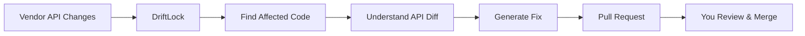
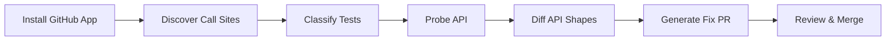
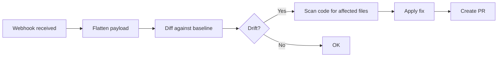

<div align="center">


# DriftLock

**Self-maintaining APIs.**

API providers announce changes. DriftLock applies them to your codebase.

DriftLock scans your codebase for API call sites, captures vendor traffic to build shape snapshots, detects breaking changes between snapshots, and opens a PR with a suggested fix. AI-powered fix generation is on the roadmap.

[Website](https://driftlock.dev) · [Discord](https://discord.gg/driftlock) · [Issues](https://github.com/nerdev-co/DriftLock/issues)

[](https://www.npmjs.com/package/@driftlock/cli)
[](https://github.com/nerdev-co/DriftLock/stargazers)
[](https://github.com/nerdev-co/DriftLock/actions)
[](./LICENSE)
[](https://coderabbit.ai)

</div>

<div align='center'>

[https://x.com/kybldmstr/status/2098413659722535174?s=20](https://x.com/kybldmstr/status/2098413659722535174?s=20)

</div>

---



---

## [The problem statement](https://www.ycombinator.com/rfs)

The original pitch that started DriftLock, verbatim:

> Over the past year, I've worked with over 50 API vendors, mostly early-stage
> startups. One pattern is consistent: API communication is broken.
>
> Breaking changes ship with little warning. Useful features quietly launch and
> go unnoticed. Changelogs don't get read. Heck, when I worked at AWS, over 30%
> of our service downtime was due to external api/package changes going
> unnoticed. This friction made sense before agentic coding tools existed.
> However, now it doesn't.
>
> Agentic coding tools like Claude Code, Devin, Greptile, etc prove that
> developers and enterprises are willing to give codebase access to external
> tools, provided they're valuable. Two years ago, this was unthinkable. Now
> it's standard practice.
>
> The infrastructure for automated code changes exists. What's missing is the
> application layer connecting API providers to their customers' codebases. API
> providers shouldn't just announce changes; they should apply them.
>
> When Stripe ships a breaking change or a new feature, an agent should scan
> customer codebases, identify affected usages, and open a PR with the fix.
>
> This could work as per-provider agents. "Install Stripe's update agent", or
> as a neutral third-party service tracking changes across vendors, like
> Dependabot but for APIs. If you're working on this, consider applying to YC.

That last line is the entire product in four words: **"Dependabot, but for
APIs"**. The sentence before it is the litmus test we use against every
feature in this repo:

> _An agent scans customer codebases, identifies affected usages, and opens a
> PR with the fix._

If a proposed feature does not move DriftLock toward that, it's plumbing or
scope creep. This section is the guard against drift.

---

## What DriftLock is

DriftLock is the application layer connecting API providers to their customers'
codebases. It's a neutral third-party service tracking changes across vendors.
The codebase access is a solved problem (agentic tools proved it); the
**application layer** is what's missing.

The cost of a vendor change always lands on the consumer. DriftLock moves it
back to automation: it scans your codebase for API call sites, watches for
vendor changes, detects how they affect your usages, and opens a PR with the
fix. AI-powered fix generation is on the roadmap.

---

## Personal story

I built DriftLock because I got bitten by an API break myself.

I had a Next.js app running on Prisma 6. Then Prisma 7 shipped, and the app broke. I didn't catch it until right before my interviews, if I hadn't noticed in time, it would have blown up in production at the worst possible moment.

That's when it clicked: dependency upgrades don't just bump a version number. They change the actual code you write. Changelogs are easy to miss. Migration guides are easy to skip. Semver doesn't save you when the API surface changes.

What I needed wasn't another tool that tells me a dependency is out of date. I needed something that would automatically update the affected code in my codebase — something that makes my APIs self-maintaining.

That's DriftLock.

---

## How it works

DriftLock has two detection modes: **outbound** (APIs you call) and **inbound** (webhooks you receive).

### Outbound drift detection



| Step         | What happens                                                   |
| ------------ | -------------------------------------------------------------- |
| **Scan**     | Static analysis finds every API call in your codebase          |
| **Classify** | Identifies which tests hit real sandbox vs. mocked             |
| **Probe**    | Runs your tests, captures actual request/response shapes       |
| **Diff**     | Compares captured shapes against the baseline snapshot         |
| **Fix**      | Generates fix suggestions; PR creation available with `--repo` |
| **Report**   | Shows which call sites are monitored, blind, or untested       |

### Inbound webhook drift detection



| Step        | What happens                                                            |
| ----------- | ----------------------------------------------------------------------- |
| **Flatten** | Converts nested JSON to dot-notation paths (`data.amount` → `"number"`) |
| **Store**   | Saves schema per endpoint + event type as baseline                      |
| **Diff**    | Detects added fields, removed fields, and type changes                  |
| **Scan**    | Finds source files referencing changed fields                           |
| **Fix**     | Applies deterministic renames, null checks, type coercions              |
| **PR**      | Creates a GitHub PR with the fix via Git Database API                   |

---

## Quick start

### CLI (outbound drift)

```bash
# Install
bun add -g @driftlock/cli

# Analyze your codebase
driftlock analyze ./src

# Run in sandbox
driftlock test ./repo

# Detect drift
driftlock fix ./repo --dry-run

# Create PR with suggested fix
driftlock fix ./repo --repo owner/repo
```

### Webhook capture (inbound drift)

**1. Start the webhook server**

```bash
cd apps/webhook
bun run dev
```

**2. Set environment variables**

```bash
# Required for PR creation
GITHUB_TOKEN=ghp_your_token

# Required to scan your codebase for fixes
WEBHOOK_REPO_PATH=/path/to/your/cloned/repo

# Required for PR creation
WEBHOOK_OWNER=your-github-org
WEBHOOK_REPO=your-repo-name
WEBHOOK_BASE=main

# Optional: Enable AI-powered fixes (choose one provider)
AI_PROVIDER=openai  # also accepts anthropic, gemini, or cloudflare
AI_API_KEY=sk-xxx   # for openai or anthropic only
AI_MODEL=gpt-4o     # optional override for openai or anthropic

# For AI_PROVIDER=gemini instead:
# GEMINI_API_KEY=your_api_key
# GEMINI_MODEL=gemini-2.5-flash  # optional, shown default

# For AI_PROVIDER=cloudflare instead:
# CLOUDFLARE_API_TOKEN=your_api_token
# CLOUDFLARE_ACCOUNT_ID=your_account_id
# CLOUDFLARE_AI_MODEL=@cf/google/gemma-4-26b-a4b-it  # optional, shown default

# Optional: Forward webhooks to your actual handler
WEBHOOK_FORWARD_URL=http://localhost:3000/api/webhooks
WEBHOOK_FORWARD_SECRET=whsec_your_secret  # optional, passed as x-webhook-secret
WEBHOOK_FORWARD_TIMEOUT=5000  # optional, default 5000ms

# Optional: Only create PRs above confidence threshold (0-100)
CONFIDENCE_THRESHOLD=70  # default 0 (always create PR)
```

**3. Register a webhook endpoint**

```bash
curl -X POST http://localhost:3001/webhooks/capture/stripe \
  -H "Content-Type: application/json" \
  -d '{"type":"payment_intent.succeeded","data":{"object":{"id":"pi_123","amount":2000,"source":"tok_visa"}}}'
```

This records the baseline schema. On the next request with a changed payload:

```bash
curl -X POST http://localhost:3001/webhooks/capture/stripe \
  -H "Content-Type: application/json" \
  -d '{"type":"payment_intent.succeeded","data":{"object":{"id":"pi_123","amount":2000,"payment_method":"pm_123"}}}'
```

Response:

```json
{
  "status": "drift_detected",
  "diff": {
    "added": ["payment_method"],
    "removed": ["source"],
    "typeChanged": []
  },
  "pr": "pending"
}
```

The system automatically:

1. Scans your repo for files referencing `source`
2. Applies the rename (`source` → `payment_method`)
3. Creates a PR via the GitHub API

### AI-powered fixes

Set `AI_PROVIDER` and the matching credentials below to enable context-aware fixes instead of simple regex replacements. Cloudflare also requires an account ID. Webhook settings can override the environment configuration; generic `AI_API_KEY` and `AI_MODEL` values are used only for `openai` and `anthropic`.

**How it works:**

1. DriftLock detects the schema change and identifies affected files
2. Sends the schema diff + source code to the LLM
3. LLM generates a fix that preserves existing functionality
4. If confidence ≥ 60%, uses the AI fix; otherwise falls back to deterministic

**Example:** For a Stripe `source` → `payment_method` change, the AI might add null checks, preserve error handling, and maintain type safety — not just find-and-replace.

```bash
# With AI fixes
AI_PROVIDER=openai AI_API_KEY=sk-xxx bun run dev

# Without AI (deterministic only)
bun run dev
```

**Supported providers:**

- OpenAI: `gpt-4o`, `gpt-4o-mini`
- Anthropic: `claude-sonnet-4-20250514`, `claude-haiku-4-20250414`
- `gemini`: requires `GEMINI_API_KEY`; optional `GEMINI_MODEL` defaults to `gemini-2.5-flash`.
- `cloudflare`: requires `CLOUDFLARE_API_TOKEN` and `CLOUDFLARE_ACCOUNT_ID`; optional `CLOUDFLARE_AI_MODEL` defaults to `@cf/google/gemma-4-26b-a4b-it`.

For `openai` and `anthropic`, use `AI_API_KEY` and optionally `AI_MODEL`.

**4. Point your Stripe webhook to DriftLock**

In the Stripe Dashboard → Webhooks → Add endpoint:

- URL: `http://your-server:3001/webhooks/capture/stripe`
- Events: select the events you handle

DriftLock forwards the payload to your handler and records the schema.

### Webhook forwarding

By default, DriftLock captures and analyzes webhooks but doesn't forward them. To use DriftLock as a proxy that observes AND passes through:

```bash
# Set the URL where your actual webhook handler lives
WEBHOOK_FORWARD_URL=http://localhost:3000/api/webhooks
```

**How it works:**

```
Stripe → DriftLock (capture + detect) → Your Handler (actual processing)
```

1. Stripe sends webhook to DriftLock
2. DriftLock flattens the payload and checks for drift
3. DriftLock forwards the original payload to your handler
4. Your handler processes it normally
5. If drift detected, DriftLock creates a PR

**Forward headers:**

- `x-driftlock-endpoint`: The endpoint ID (e.g., "stripe")
- `x-driftlock-event`: The event type (e.g., "payment_intent.succeeded")
- `x-driftlock-forwarded`: Always "true"
- `x-webhook-secret`: Your secret (if `WEBHOOK_FORWARD_SECRET` is set)

**Response includes forwarding status:**

```json
{
  "status": "ok",
  "forward": {
    "ok": true,
    "status": 200,
    "elapsed": 150
  }
}
```

### Confidence filtering

Not all schema changes are equally risky. Confidence filtering lets you skip PRs for low-confidence drifts.

**How confidence is calculated:**

| Factor         | Impact |
| -------------- | ------ |
| 1 change       | +20    |
| ≤3 changes     | +10    |
| Fields removed | +15    |
| Fields added   | +10    |
| Type changes   | +5     |
| Unknown types  | -20    |

**Threshold behavior:**

- `CONFIDENCE_THRESHOLD=0` (default): Always create PRs
- `CONFIDENCE_THRESHOLD=50`: Skip very uncertain drifts
- `CONFIDENCE_THRESHOLD=70`: Only create PRs for clear, confident changes
- `CONFIDENCE_THRESHOLD=90`: Only near-certain changes

**Example:**

```bash
# Only create PRs when confidence >= 70
CONFIDENCE_THRESHOLD=70 bun run dev
```

The confidence score is also returned in the webhook response:

```json
{
  "status": "drift_detected",
  "confidence": 75,
  "diff": { ... }
}
```

---

## What you're used to vs. what DriftLock does

| Today                                  | With DriftLock                                   |
| -------------------------------------- | ------------------------------------------------ |
| Avoid upgrades because they're tedious | Automated codebase scanning                      |
| Manually find affected call sites      | All affected calls found automatically           |
| Copy-paste migration guide changes     | Fix suggestions generated, PR creation available |
| Weeks to upgrade, so you put it off    | Minutes to review a PR                           |
| Stuck on old versions                  | Stay current with minimal effort                 |

---

## Why not Renovate / Dependabot?

They update the version number in `package.json`. They don't change your code.

When `stripe.charges.create({ amount: 100 })` needs to become `stripe.charges.create({ value: 100 })`, Renovate doesn't touch that. DriftLock does.

| Renovate              | DriftLock                   |
| --------------------- | --------------------------- |
| Bumps version         | Updates your code           |
| Handles `npm install` | Handles call site migration |
| Dependency management | Code migration              |

---

## Why not just semver?

Semver is a convention, not a guarantee. Many APIs don't follow it strictly. And even when they do, upgrading major versions means manually finding and fixing every affected call site — which is why teams avoid it.

DriftLock works regardless of versioning scheme. It monitors the actual API surface, not the version number.

---

## Why not just test coverage?

High test coverage helps — if your tests aren't mocked. Most are. DriftLock classifies which tests actually hit the real API vs. which just mock the response. You can't catch API drift with mocked tests.

---

## First target: Stripe

Stripe has mature test mode, huge installed base, and plenty of teams stuck on old API versions. First vendor — not the only one.

Twilio, Shopify, and others are on the roadmap.

AI-powered fix generation is on the roadmap. The current implementation captures traffic shapes, detects drift between snapshots, and applies deterministic fixes; full automated PR generation with AI-generated patches is planned.

---

## Security

If you discover a security vulnerability, please report it responsibly.

**Email:** nalin@nerdev.in

Do NOT open a public GitHub issue for security vulnerabilities.

---

## Contributing

We welcome contributions! See [CONTRIBUTING.md](./CONTRIBUTING.md) for guidelines.

---

## Community

- [Discord](https://discord.gg/driftlock) — Ask questions, share feedback
- [GitHub Discussions](https://github.com/nerdev-co/DriftLock/discussions) — Architecture decisions, design talks
- [Twitter](https://twitter.com/driftlock) — Updates and announcements

---

## License

MIT © [DriftLock](https://github.com/nerdev-co/DriftLock)
