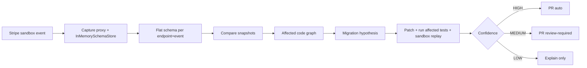

# Design: Webhook-First Wedge — Never Let a Third-Party Webhook Break You

## Problem
Stripe (and similar) webhook handlers break silently: `data.object.source` disappears, `data.object.payment_method` appears. Current DriftLock detected the diff but generated `// source: paymentIntent.source` — not a migration. Competitors (Routebase, mendapi) already do spec-diff → AST scan → PR, but rarely verify the webhook payload your code actually reads.

Why now: YC RFS validates the problem, but multiple builders already ship. Breadth will not win; a verifiable webhook loop will.

## Requirements
### Functional
- Stripe webhook `payment_intent.*` and `charge.*` drift detection without requiring a vendor OpenAPI.
- Per-call-site contracts: `src/webhook.js:19` reads `data.object.source` → dependency node.
- Confidence-gated PRs (HIGH/MEDIUM/LOW) with evidence; LOW never auto-edits prod code.
- API Coverage command `driftlock coverage` reporting `MONITORED / BLIND (mocked) / UNTESTED`.

### Non-Functional
- Performance: capture + diff <5s on `stripe-test` fixture.
- Reliability: sandbox replay must reproduce before PR is marked HIGH.
- Security: no secrets in `.driftlock.yml`; use `OPENAI_API_KEY` env.

## Current State
- Detection exists (`schemaFlattener` → `diffSchemas` → `added/removed/typeChanged`), but fix is `comment-out` (`packages/tests/unit/diff/fixWorks.test.ts`).
- No dependency graph (only file-level scan), no mock detection, no verification loop.
- Stripe is first provider; Twilio/Shopify listed as future but not needed now.

## Proposed Solution
### High-Level Architecture


### Data Model
```typescript
// docs/adr/001 model + per-call-site
interface CallSiteContract {
  file: string; line: number;
  endpoint: string; eventType: string;
  readFields: string[]; // e.g. ["data.object.source"]
  testStatus: "MONITORED" | "BLIND" | "UNTESTED";
  snapshot: FlatSchema;
}
```

### API Contract
- CLI: `driftlock coverage` → coverage table (future)
- CLI: `driftlock fix --dry-run` → drift diff + affected graph (existing, enhance)
- Webhook: `POST /webhooks/stripe/:endpointId` → `DriftDetector.processPayload` → `DriftAlert | RollbackAlert`

### Algorithm / Logic
- Mock detection: `AST: jest.mock("stripe")` + test runtime: no real `api.stripe.com` traffic → BLIND.
- Migration hypothesis: `removed: source` + `added: payment_method` on same `data.object` parent → semantic check: are both string IDs under same API version? If not equivalent → LOW.
- Verification: apply patch → run `vitest` for affected test files → replay historical request vs new schema → compare behavior.

## Implementation Plan
### Phase 1: Foundation (this sprint, do not expand providers)
- [ ] Dependency graph: `src/webhooks/*` → field reads → call site nodes.
- [ ] Coverage report: count MONITORED/BLIND/UNTESTED for Stripe.
- [ ] Mock-vs-real detector (`jest.mock`, `nock`, `msw`).

### Phase 2: Correct Fix + Verification
- [ ] Stripe webhook migration: `source` → `payment_method` mapping with semantic check (not comment-out).
- [ ] Verification loop: patch → tests → sandbox → evidence in PR body.
- [ ] Docstring generation for touched functions to satisfy `80% docs` gate (from `stripe-test#2` review).

### Phase 3: Confidence Gating
- [ ] HIGH/MEDIUM/LOW thresholds and PR labels.
- [ ] "Explain only" path for LOW.

## Testing Strategy
### Unit Tests
- `spec.test.ts` diff taxonomy, `fixWorks.test.ts` migration reasoning.

### Integration Tests
- `stripe-test` fixture: 5 deliberate breaking changes: 2 HIGH auto-fix cases, 1 MEDIUM review-required case, and 2 LOW explain-only cases.

### E2E Tests
- `fixtures/sample-project` webhook handler end-to-end: change payload → PR with evidence.

### Load/Chaos Tests
- N/A for wedge.

## Rollout Plan
- Feature flag: `FEATURE_WEBHOOK_WEDGE=true` (existing config).
- Metrics: drift detection recall, HIGH auto-fix precision, PR merge rate.
- Rollback: revert to previous `FileSnapshotStore` if wedge regresses.

## Operational Considerations
- Logging: `[DRIFT]`, `[ROLLBACK]`, `[PR]` already in `apps/webhook/capture.ts:68`.
- Monitoring: drift confidence histogram.
- Runbook: `docs/incidents/` if sandbox flake.

## Security Considerations
- No `OPENAI_API_KEY` in `.driftlock.yml`; env only.

## Future Extensions
- Combine vendor changelog + observed behavior (later, per ADR 001 diagram).

## Open Questions
- What is the exact threshold for HIGH vs MEDIUM (e.g., semantic equivalence score)?

---
*Status: Draft*
*Author: Nalin — skillset customer-research + blueprint + verification-loop*
*Reviewers: *
*Created: 2026-09-24*
